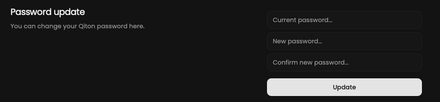

<Warning>Changing your password will automatically log out of all your devices.</Warning>

Your password serves as the sole barrier between your data and the external world, so make sure to choose a strong one.
For instructions on how to change your password, please refer to the following.

## Prerequisites

- An account

## Steps

Start by going to the settings page at [qiton.app/settings](https://qiton.app/settings).

## Change password

Fill in the form to change your password.
You will be logged out.

<Frame>
    
    
</Frame>
