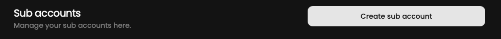
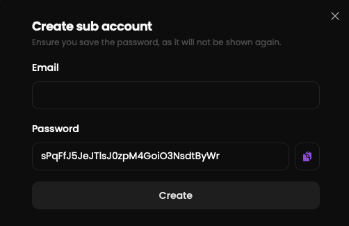

As a coach, you might want to share your account with your players without disclosing your password and administrator
privileges.
Subaccounts make this possible now.

## Prerequisites

- An account

## Steps

Start by going to the settings page at [qiton.app/settings](https://qiton.app/settings).

## Create subaccount

<Frame>
    
</Frame>

After clicking on the **Create subaccount** button, you will be prompted to fill in the email of your new user.
For security reasons, the password is automatically generated.

<Frame>
    
</Frame>

Share the credentials with your user.

## Permissions

A subaccount can perform any task that a regular user can do, except for:
- `Manage subscriptions`
- `Manage subaccounts`
- `Modify the GRID.GG token`
- `Modify the team owner`
- `Modify the Metrics`
- `Reset a match`
