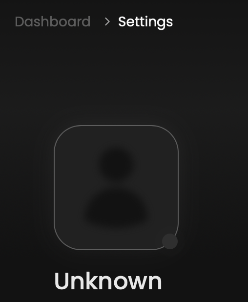
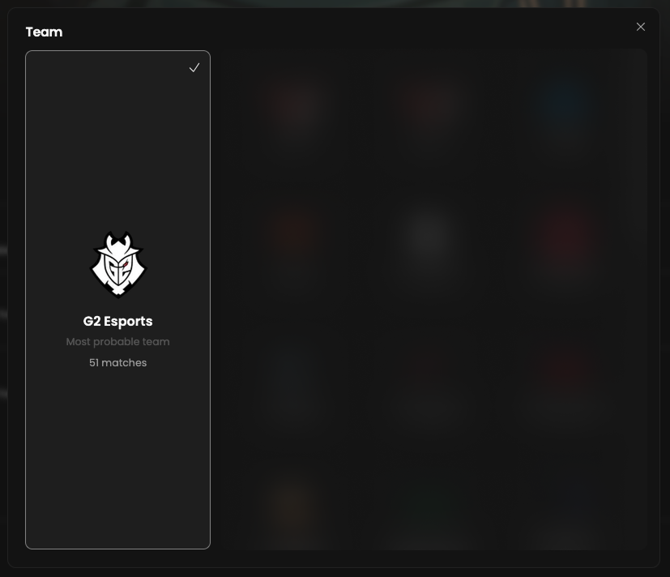

Our data provider GRID.GG doesn’t disclose which team currently owns the API token in use.
Therefore, you must select a team from the list of teams detected in Scrims on your side.
This decision enables us to provide you with personalized content.

_Please note that this action is usually done by Qiton during the onboarding._

## Prerequisites

- An active account ([learn more](/get-started/setup))

## Steps

Start by going to the settings page at [qiton.app/settings](https://qiton.app/settings).

## Selection

Click on the profile icon.

<Frame>
    
</Frame>

Then you will see a list of every opponent you encounter during your training sessions.

<Frame>
    
</Frame>

_This image has been blurred to hide confidential data._

Feel free to choose your team.
