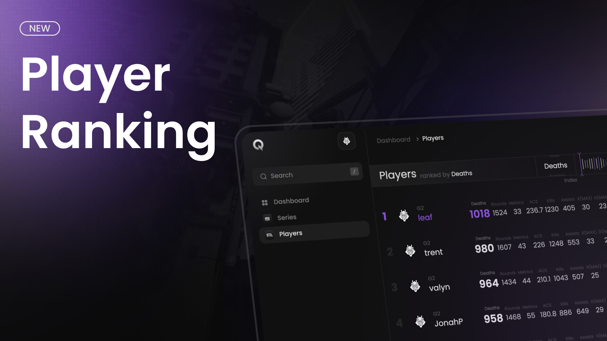

<Update label="May 13th, 2025">
## 👑 Ranking of Kings 👑
  <Frame>
    
  </Frame>

  New page to rank players based on all stats available on Qiton.

  **Features**

    Rank and compare any player based on any stat available with the following filters:

  **Filters**

    * `Index` is the stat that determines how to rank players. (by metrics for ex.)
    * `Days` a time filter.
    * `Rounds` the minimum rounds played by players.
    * `scrims I/O` to know if we display data from scrims or not. (SOON)
    * `Team` the player's team.
    * `Agent` the players that played the agent.
    * `Map` the players that played in this map.
    * `Side` the side attack/defense/all (SOON)
</Update>