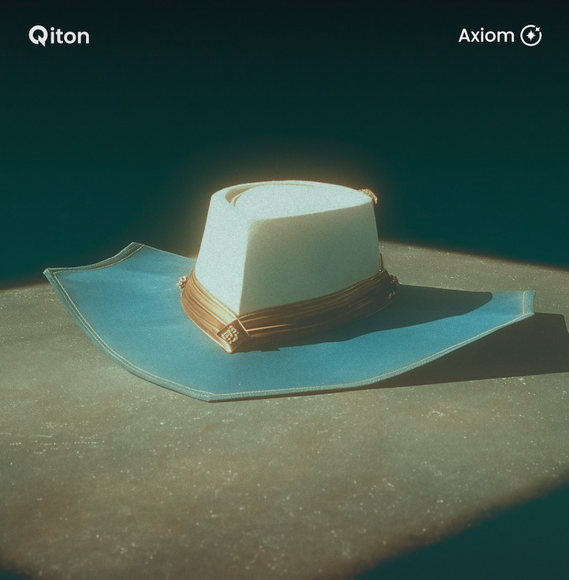

<Frame>
    
</Frame>

Qiton was born 2 years ago with a singular and intuitive idea; to assist an esports analyst in devising the most
effective strategy for their team’s victory.

And that's exactly what we have been doing for the last 24 months.

Today we are delighted to announce our latest tool to help you win.
We named it Axiom, our cutting-edge anti-strategic instrument.

## How it works ?

As a coach, you frequently attempt to counter offensive and defensive strategies.
Axiom is here to unveil your opponent’s strategies in a single click well before match day.

## I want to try it

You may already know it, but the time it takes to develop a such feature is extremely time-consuming.
That's why we try to be discrete about it.
However, if you want a live or an account demonstration [contact us](/miscellaneous/support).
