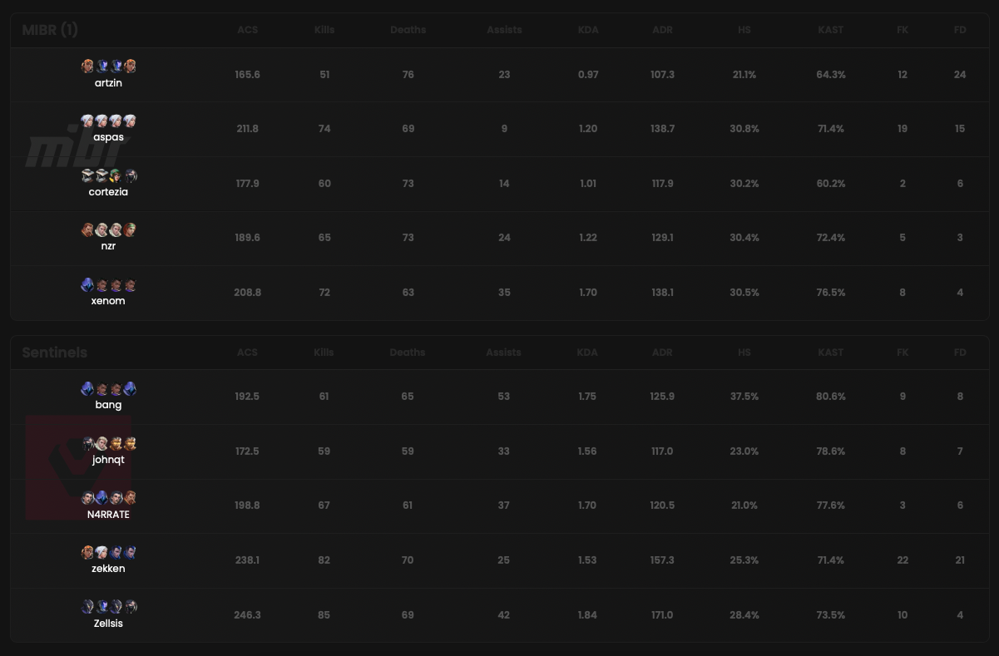

## Prerequisites

- An active account ([learn more](/get-started/setup))
- You have to select a match beforehand ([learn more](/core/matches))

## Scoreboard

<Frame>
    
    
</Frame>

Multiple scoreboards are available for each match:
- One globally (as you can see above)
- One per sub-match
