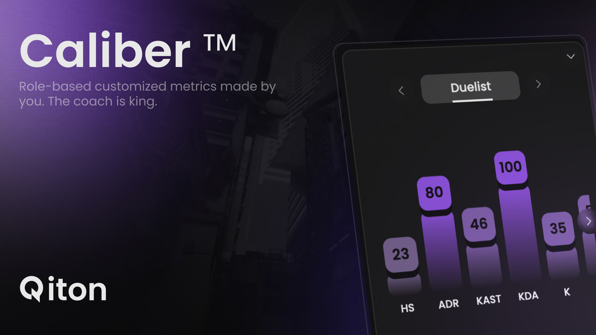

<Frame>
  
  
</Frame>

# What is Caliber™?

**Caliber™** is a **weights-based performance system** designed specifically for _Valorant_.

> It evaluates your impact differently based on your **agent’s role**—so playing **Jett** won’t be judged the same way as **Omen**.

You get **custom-tailored ratings** that reflect both your role and your priorities in the match.

---

## Why use it?

Not every role should be measured the same way.

| Role        | Focus                                                  |
|-------------|--------------------------------------------------------|
| **Duelist** | Entry, frags, clutch potential                         |
| **Sentinel**| Utility use, area control, team support                |
| **Controller/Initiator** | Map control, setup plays, enabling teammates |

<Callout emoji="🎯">
There’s no such thing as a universal performance score in Valorant. Caliber™ fixes that.
</Callout>

---

## How it works

Adjust **weights** per role to define what matters most for each.

<Frame>
  <video
    autoPlay
    muted
    loop
    playsInline
    className="w-full aspect-video block dark:hidden"
    src="./images/metrics/caliber_showcase.mp4"
  ></video>
  <video
    autoPlay
    muted
    loop
    playsInline
    className="w-full aspect-video hidden dark:block"
    src="./images/metrics/caliber_showcase.mp4"
  ></video>
</Frame>

### 🔧 Roles Available

- `Duelist`
- `Sentinel`
- `Controller`
- `Initiator`

### 📊 Stats You Can Weight

- `Headshots`
- `ADR` (Average Damage per Round)
- `KAST` (Kill/Assist/Survive/Trade)
- `KDA`
- `Kills`
- `Deaths`
- `Assists`
- `First Kills`
- `First Deaths`
- `ACS` (Average Combat Score)
- `Trades`
- `Trades/Death`

---

## Where do I see Caliber™ scores?

Caliber™ scores are shown **per game**, and **averaged across matches or players** for deeper insights.

### 🎮 Game-Specific Score
- Based on your **role in that specific match**
  _(e.g. Duelist → weighted for frags, trades, etc.)_

### 📈 Aggregated Score
- **Player**, **team**, or **series** averages over multiple games

---

<Check>
Caliber™ helps you understand **how well you’re playing** in the context that matters most: your role.
</Check>
