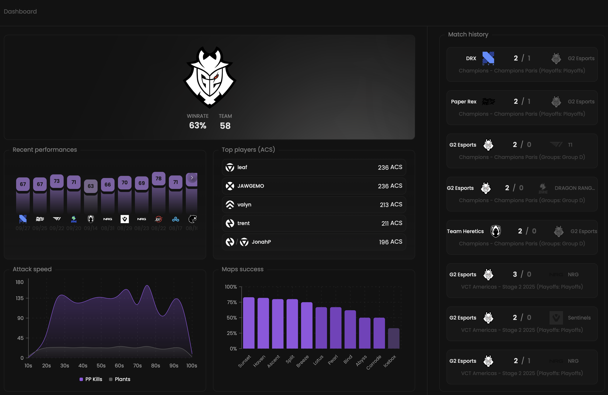
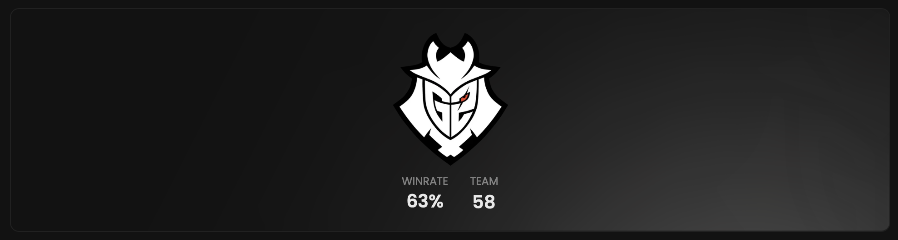
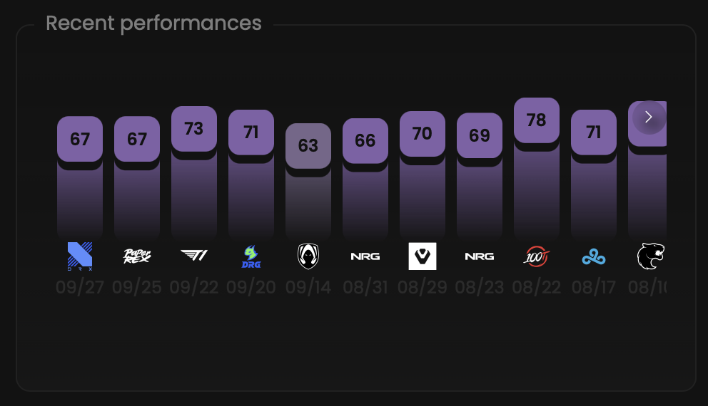
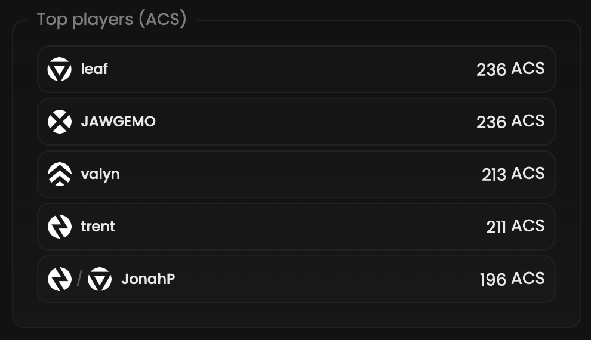
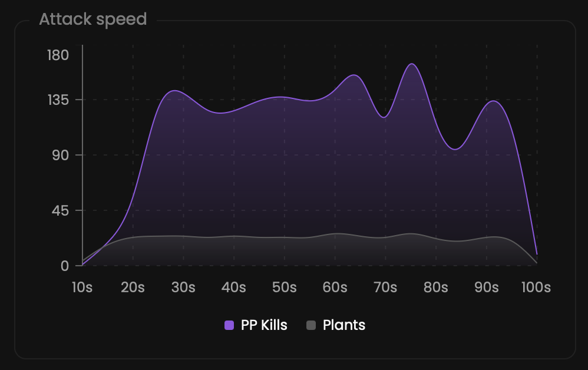
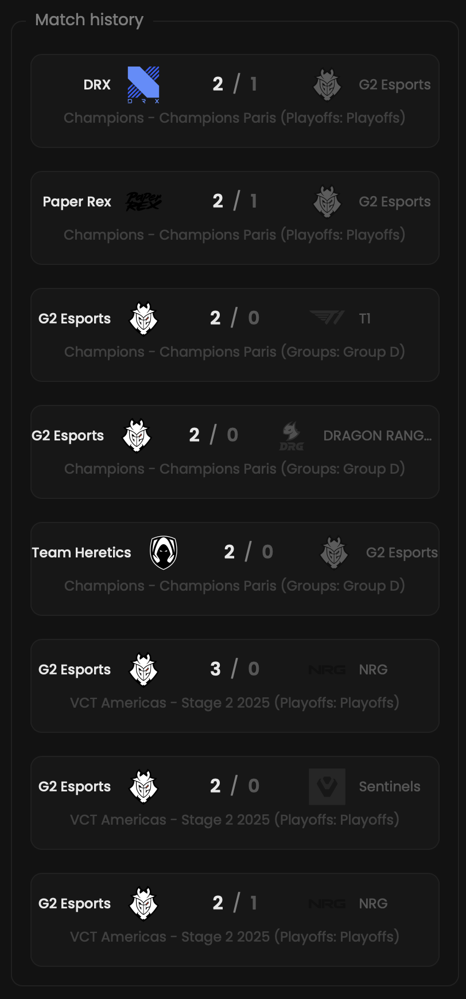

<Frame>
    
</Frame>

We are introducing Dashboard, a new homepage that displays key performance indicators related to your team.

## Prerequisites

- An active account ([learn more](/get-started/setup))
- Team owner set up ([learn more](/account/team-owner))

## Preview

<Frame>
    
</Frame>

As you can see, we display 6 different components with, obviously, 6 different purposes.

### Summary

<Frame>
    
</Frame>

### Recent performances

<Frame>
    
</Frame>

### Top players

<Frame>
    
</Frame>

### Attack speed

<Frame>
    
</Frame>

### Maps success

<Frame>
    
</Frame>

### Matches history

<Frame>
    
</Frame>

_All statistics above have not been detailed because they correspond to the [Team page](/core/team/summary)._
