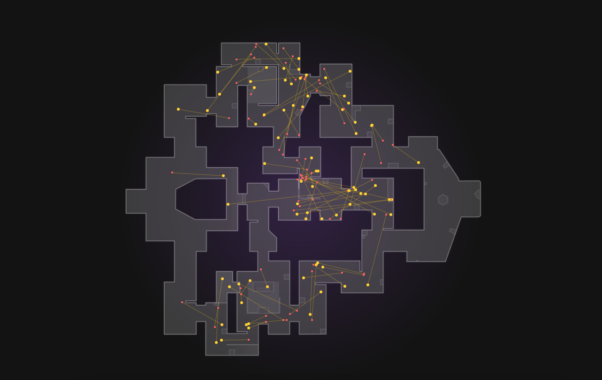
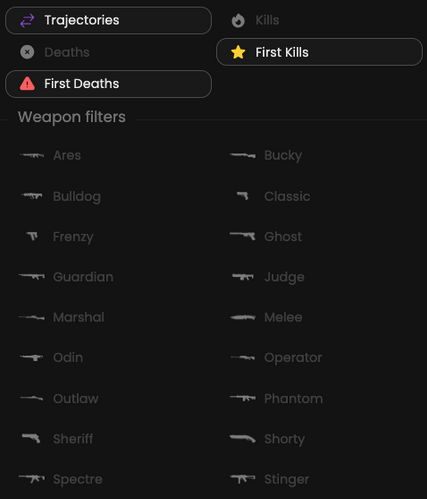

We provide you with the capability to analyze the most recent 1000 kills for the selected map.

## Prerequisites

- An active account ([learn more](/get-started/setup))
- You have to select a map beforehand ([learn more](/core/map/root))

## Steps

Navigate to the **Heatmaps** tab.

## Preview

<Frame>
    
</Frame>

## Available statistics

- `Positions`

## Available filters

- `Kills`
- `Deaths`
- `First Kills`
- `First Deaths`
- `Weapons`

<Frame>
    
</Frame>
