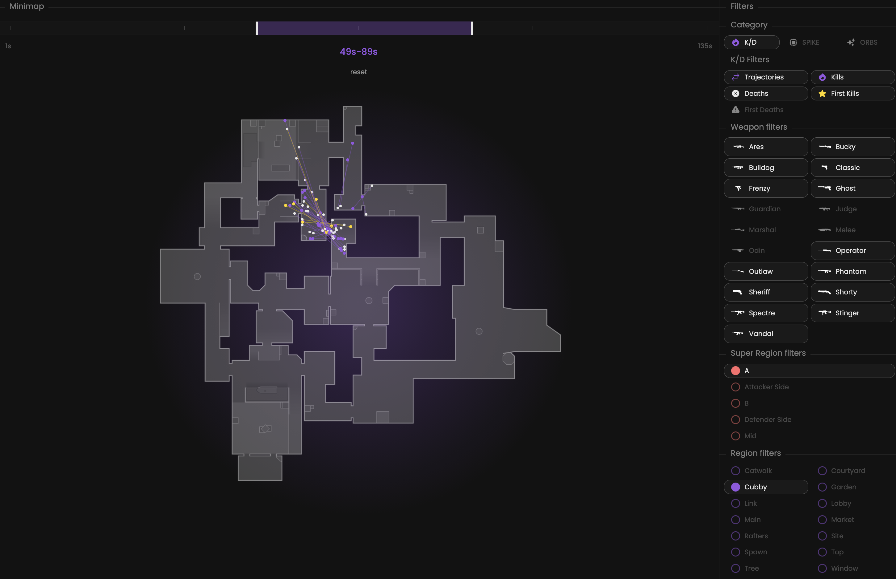

We provide you with the capability to analyze the most recent 4000 kills for the selected map.

## Prerequisites

- An active account ([learn more](/get-started/setup))
- You have to select a map beforehand ([learn more](/core/map/root))

## Steps

Navigate to the **Heatmaps** tab.

## Preview

<Frame>
    
</Frame>

## Available statistics

Depending on the selected category, you will have access to different statistics.

### K/D category

- `Positions`
- `Trajectories`

### Spike category

- `Positions`

### ORBs category

- `Positions`
- `How many times ORBs have been recolted`

## Available filters

Depending on the selected category, you will have access to different filters.

### K/D category

- `Time interval`
- `Trajectories`
- `Kills`
- `Deaths`
- `First Kills`
- `First Deaths`
- `Weapons`
- `Regions`

<Frame>
    
</Frame>

### Spike category

- `Defused Only`
- `Exploded Only`
- `Sites`

<Frame>
    
</Frame>

### ORBs category

_None for now._

<Frame>
    
</Frame>
