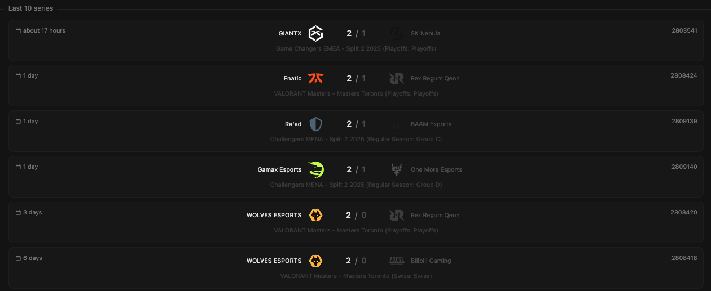

You can view the latest matches that take place on the map you have selected.

## Prerequisites

- An active account ([learn more](/get-started/setup))
- You have to select a map beforehand ([learn more](/core/map/root))

## Steps

Navigate to the **History** tab.

## Preview

<Frame>
    
</Frame>
