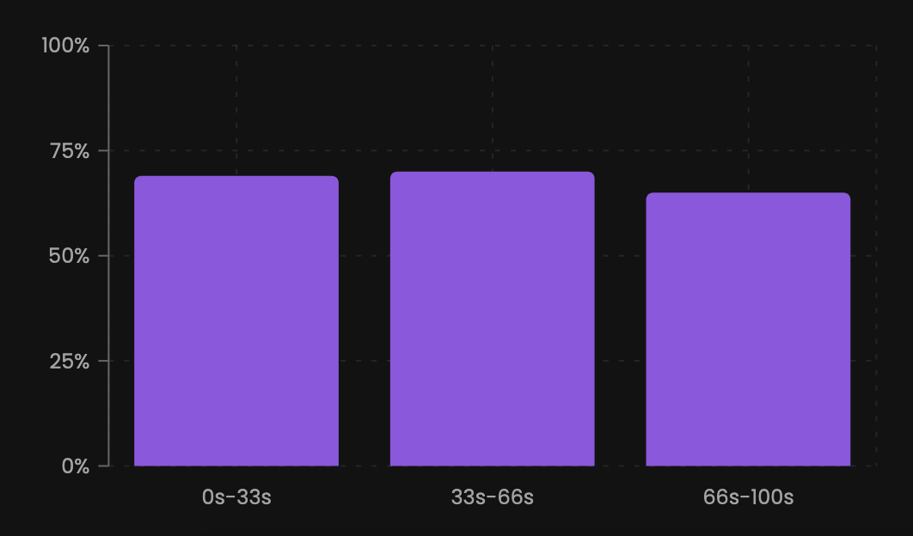

Determine your aggressive play by understanding if the selected map is suitable for fast or durable actions.

## Prerequisites

- An active account ([learn more](/get-started/setup))
- You have to select a map beforehand ([learn more](/core/map/root))

## Steps

Navigate to the **Overview** tab.

## Preview

<Frame>
    
</Frame>

## Available statistics

- `Wins percentage when planting between 0 and 33 seconds`
- `Wins percentage when planting between 33 and 66 seconds`
- `Wins percentage when planting between 66 and 100 seconds`

## Available filters

- `Dates`
- `Scrims`
- `Officials`
- `Tournaments`
- `Teams`

<Frame>
    
</Frame>
