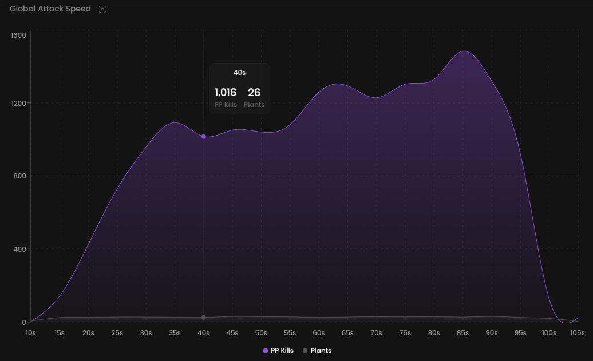

Explore how often players plant the spike for the selected map.
As a coach, you can test new strategies to attack when your enemies least expect it.

## Prerequisites

- An active account ([learn more](/get-started/setup))
- You have to select a map beforehand ([learn more](/core/map/root))

## Steps

Navigate to the **Overview** tab.

## Preview

<Frame>
    
</Frame>

## Available statistics

- `Total pre-plant kills each 5 seconds`
- `Total plants each 5 seconds`
