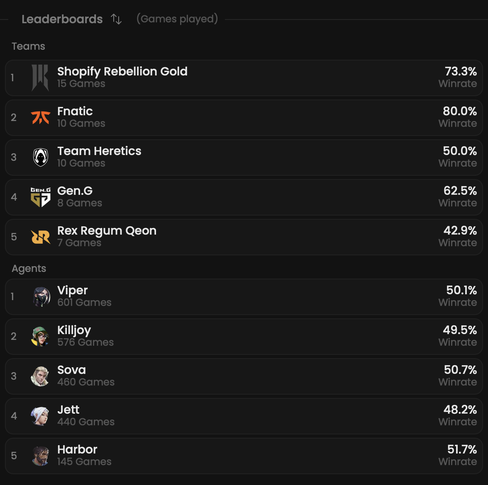
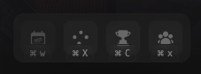

Discover which teams and agents perform the best on the selected map.
The objective is to determine, for instance, the advantages that a specific agent might possess in this environment.

## Prerequisites

- An active account ([learn more](/get-started/setup))
- You have to select a map beforehand ([learn more](/core/map/root))

## Steps

Navigate to the **Overview** tab.

## Preview

<Frame>
    
</Frame>

## Available statistics

- `Teams (name, winrate & games played)`
- `Agents (name, winrate & games played)`

## Available filters

- `Games played`
- `Winrate`
- `Dates`
- `Scrims`
- `Officials`
- `Tournaments`
- `Teams`

<Frame>
    
</Frame>
