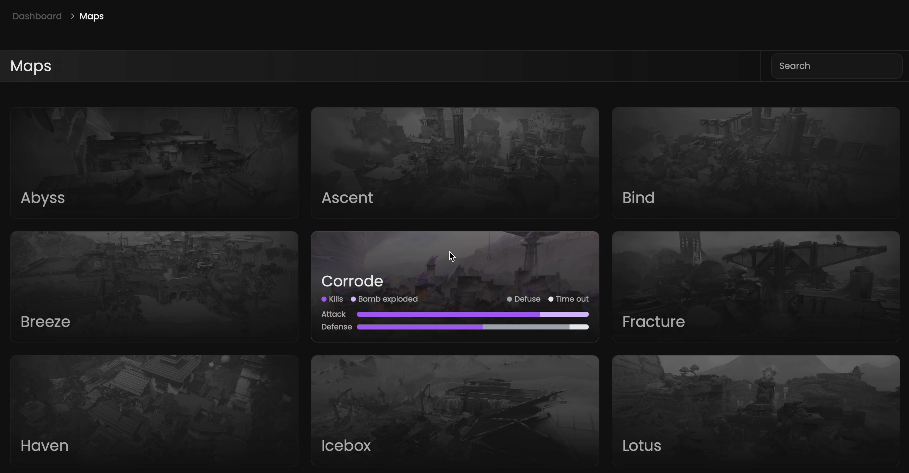

Qiton is one of the pioneering services that provides statistics based on maps.
We want you to measure the impact of the maps difficulty and specificity.

## Prerequisites

- An active account ([learn more](/get-started/setup))

## Steps

Start by going to the maps page at [qiton.app/maps](https://qiton.app/maps).
You will find all maps detected by our system.

## Preview

<Frame>
    
</Frame>

## Available filters

- `Map name`

<Frame>
    
</Frame>
