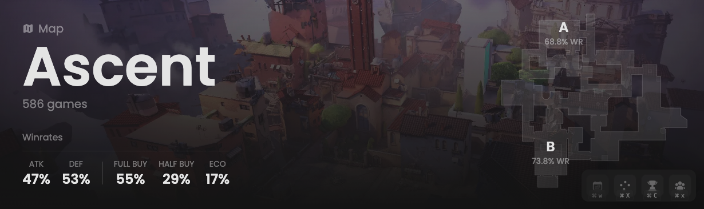

<Frame>
    <video
        autoPlay
        muted
        loop
        playsInline
        className="w-full aspect-video"
        src="./images/summary/presentation.mp4"
    ></video>
</Frame>

This header provides global data about all matches played on this map.
This allows you to determine, for instance, if the attacking side has an advantage over the defending one.

## Prerequisites

- An active account ([learn more](/get-started/setup))
- You have to select a map beforehand ([learn more](/core/map/root))

## Preview

<Frame>
    
</Frame>

## Available statistics

- `Map name`
- `Total number of sub-matches played`
- `Attacking wins percentage (per round)`
- `Defending wins percentage (per round)`
- `Wins percentage of full buy (per round)`
- `Wins percentage of half buy (per round)`
- `Wins percentage of eco (per round)`
- `Wins percentage when planting per side`
