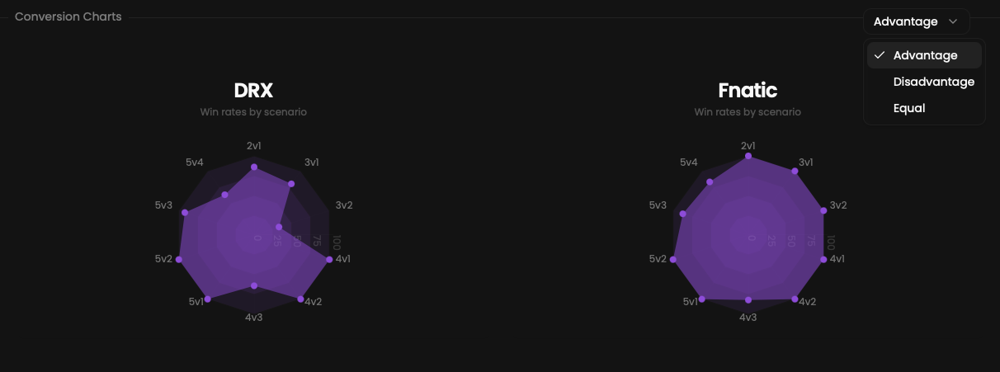

Conversions display your win rate in various situations within the currently selected match, such as 1v1, 1v2 and so on.

## Prerequisites

- An active account ([learn more](/get-started/setup))
- You have to select a match beforehand ([learn more](/core/match/root))

## Availability

Multiple conversions are available for each match:
- One globally
- One per sub-match

## Preview

<Frame>
    
</Frame>

## Available statistics

- `Total wins & losses in existing situations per team`

## Available filters

- `Advantage`
- `Disadvantage`
- `Equal`

Modify the scope of the provided statistics based on the following situations.
- `Attack & defense`
- `Attack`
- `Defense`
