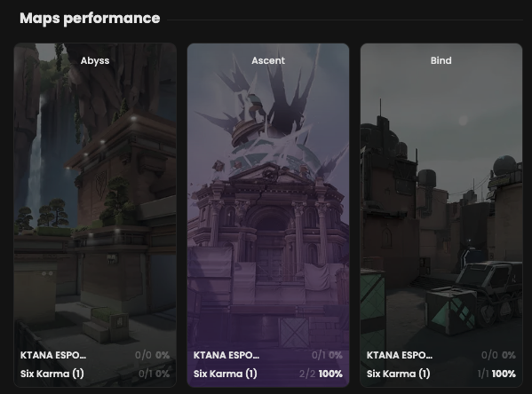

Check if the latest confrontations involving the same teams have been successful.

## Prerequisites

- An active account ([learn more](/get-started/setup))
- You have to select a match beforehand ([learn more](/core/match/root))

## Steps

Navigate to the **Overview** tab. Not available in sub-match tabs.

## Preview

<Frame>
    
    
</Frame>

## Available statistics

- `Wins percentage per team per map`
