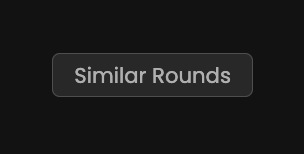
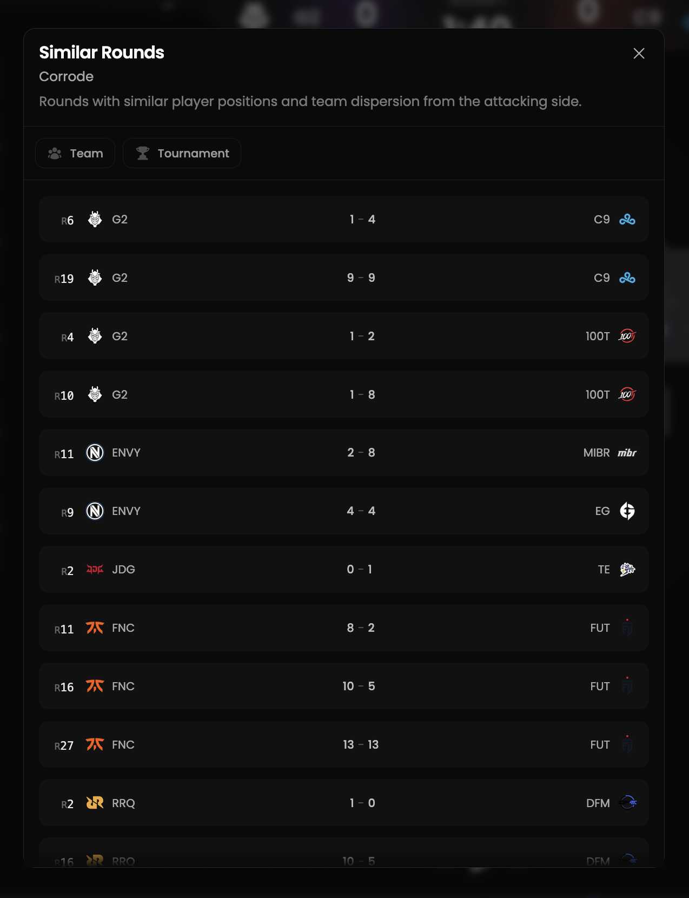
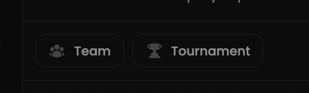

Our AI-powered similarity detection analyzes replays to find comparable rounds.
The system calculates similarity scores by evaluating player movements, positioning and actions.

Leverage Qiton's AI to identify strategic patterns across rounds and develop targeted counterplay.

Please note that this functionality is still new and is constantly improved by the developers.

## Prerequisites

- An active account ([learn more](/get-started/setup))
- You have to select a match replay beforehand ([learn more](/core/match/replay/the-player))

## Steps

This feature is available for all replays.
Click on the **Similar Rounds** button and a tab will open.

<Frame>
    
</Frame>

## Preview

<Frame>
    
</Frame>

The most similar rounds are at the top.

## Available filters

- `Team`
- `Tournament`

<Frame>
    
</Frame>
