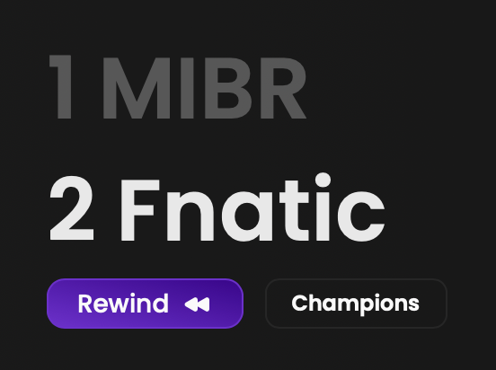
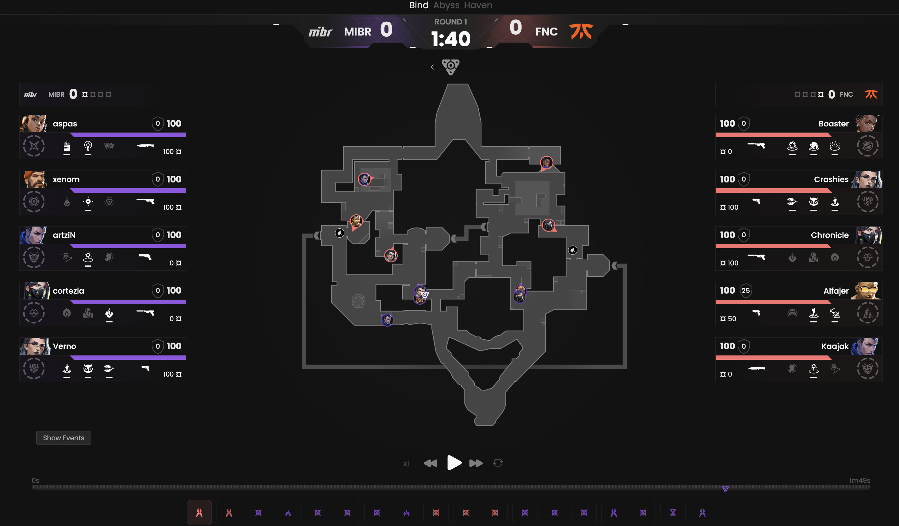
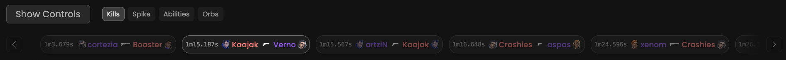
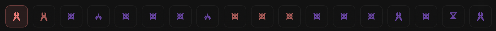
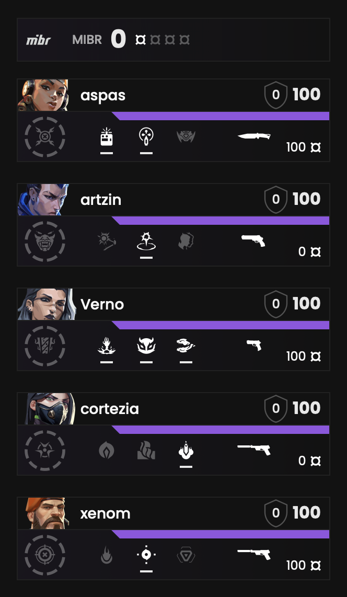
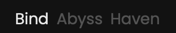

<Frame>
    <video
        autoPlay
        muted
        loop
        playsInline
        className="w-full aspect-video"
        src="./images/the-player/presentation.mp4"
    ></video>
</Frame>

The replay feature enables you to revisit all players' moves, kills and abilities during a round.
As a coach this feature provides valuable insights into your players' strengths and weaknesses.

Imagine our feature as a music player allowing you to **start**, **pause** and **speed up** the timeline.

## Prerequisites

- An active account ([learn more](/get-started/setup))
- You have to select a match beforehand ([learn more](/core/match/root))

## Steps

Replay is available for all matches.
In the first place click on the **Replay** button, and you will be redirected.

<Frame>
    
</Frame>

## Preview

<Frame>
    
</Frame>

The map provides you with the following information:
- `Players' positions`
- `Players' aiming directions`
- `Abilities used`
- `Kills positions`
- `ORBs positions`
- `Spike position`

_These data are continuously updated in real-time._

### Events

<Frame>
    
</Frame>

This section showcases all events including kills and plants for the selected round.

Furthermore, you can click on an event to refresh **The Replay Player** and view what happened at this moment.

### Rounds

<Frame>
    
</Frame>

This section is relatively similar to the previous one, as it displays all rounds for the selected sub-match.

Furthermore, you can click on a round to refresh **The Replay Player**.

### Agents

<Frame>
    
</Frame>

For each player on both teams, you will get the following information:
- `Player's name`
- `Agent's name`
- `Weapon currently in use`
- `HP`
- `Shield capacity`
- `Money`
- `Available and unavailable abilities`

_These data are continuously updated in real-time._

### Sub-matches

<Frame>
    
</Frame>

As you may already know a match is composed of sub-matches.
You can switch between them here.
