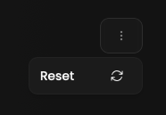

<Warning>Rate limiting implementation. We accept only 2 requests per hour for this action.</Warning>

If you notice any errors in a match, please feel free to reset it.
After the next hour we will download the match from GRID.GG and process it again.

## Prerequisites

- An active account ([learn more](/get-started/setup))
- You have to select a match beforehand ([learn more](/core/match/root))

## Preview

<Frame>
    
</Frame>
