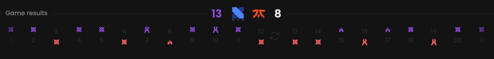

## Prerequisites

- An active account ([learn more](/get-started/setup))
- You have to select a match beforehand ([learn more](/core/match/root))

## Availability

Navigate to sub-match tabs. Not available in the **Overview** tab.

## Preview

<Frame>
    
</Frame>

## Available statistics

- `Final score for both teams`
- `Win condition per round`
