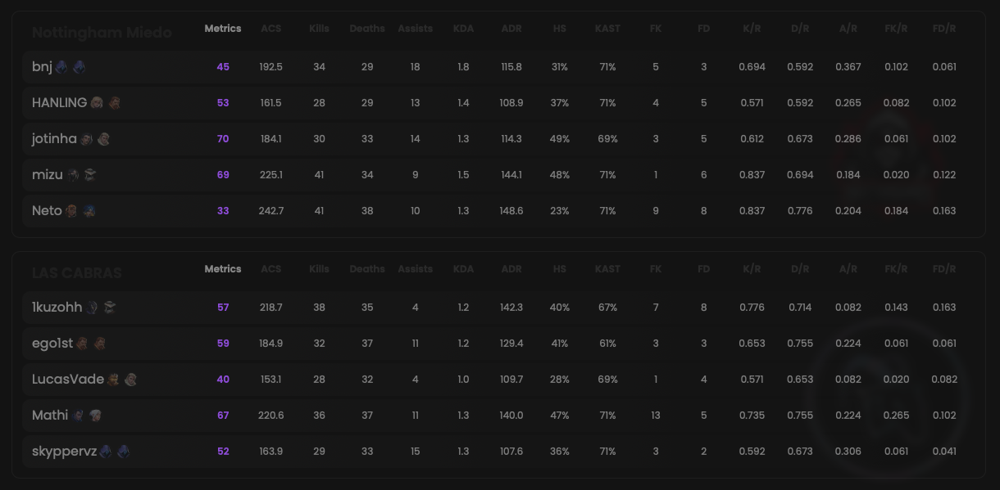

Multiple scoreboards are available for each match:
- One globally
- One per sub-match

## Prerequisites

- An active account ([learn more](/get-started/setup))
- You have to select a match beforehand ([learn more](/core/match/root))

## Preview

<Frame>
    
    
</Frame>

## Available statistics

- `Metrics`
- `ACS`
- `Kills`
- `Deaths`
- `Assists`
- `Trades`
- `KDA`
- `ADR`
- `HS`
- `KAST`
- `FK`
- `FD`
- `K/R`
- `D/R`
- `A/R`
- `FK/R`
- `FD/R`
- `T/R`

Descriptions are available [here](/core/statistics-meaning).

## Metrics preset

Each player’s preset is determined by their role.
Learn more [here](/core/metrics).
