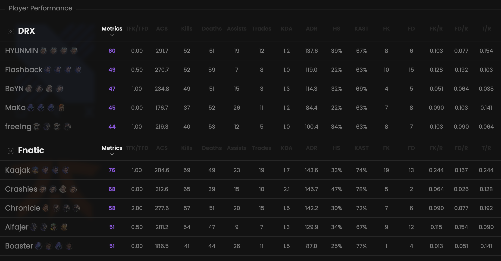

Some values to evaluate the players' performance during a particular match.

## Prerequisites

- An active account ([learn more](/get-started/setup))
- You have to select a match beforehand ([learn more](/core/match/root))

## Availability

Multiple scoreboards are available for each match:
- One globally
- One per sub-match

## Preview

<Frame>
    
</Frame>

## Available statistics

- `Metrics`
- `ACS`
- `Kills`
- `Deaths`
- `Assists`
- `Trades`
- `KDA`
- `ADR`
- `HS`
- `KAST`
- `FK`
- `FD`
- `K/R`
- `D/R`
- `A/R`
- `FK/R`
- `FD/R`
- `T/R`

Descriptions are available [here](/core/statistics-meaning).

## Available filters

Modify the scope of the provided statistics based on the following situations.
- `Attack & defense`
- `Attack`
- `Defense`

## Metrics

Each Metrics score displayed on this page is calculated through the following steps.

1. For each sub-match linked to **the selected match**, we calculate a Metrics score by considering **the role's
preset** and **the player's statistics**.
2. We then calculate the final score by taking a **weighted average** of all these scores.

Learn more [here](/core/metrics).
