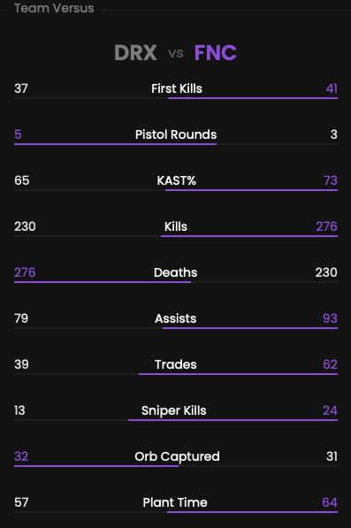

Multiple versus are available for each match:
- One globally
- One per sub-match

## Prerequisites

- An active account ([learn more](/get-started/setup))
- You have to select a match beforehand ([learn more](/core/match/root))

## Preview

<Frame>
    
    
</Frame>

## Available statistics

- `First Kills`
- `Pistol Rounds`
- `KAST`
- `Kills`
- `Deaths`
- `Assists`
- `Trades`
- `Sniper Kills`
- `Orb Captured`
- `Plant Time`

Descriptions are available [here](/core/statistics-meaning).
