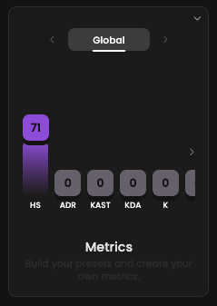

<Frame>
    
    
</Frame>

Our Metrics feature empowers coaches to assign weights to statistics based on their personal preferences and perceived
significance.
**For instance, a Duelist might prioritize ADR over HS.**

## Steps

The component is always displayed across the application at bottom left.

## Presets available
- `Global`
- `Duelist`
- `Sentinel`
- `Controller`
- `Initiator`
- `Custom`, please don't take into account this preset. It's not used for now

## How roles are assigned

How we assign players roles is based solely on statistics.
If a player has played a significant amount of Jett, we will assign him the Duelist role.

## What preset is used

Depending on the pages, we could use the Global or role preset.
Please refer to the documentation.
Whenever a Metrics score is displayed, we precise the preset in use.
