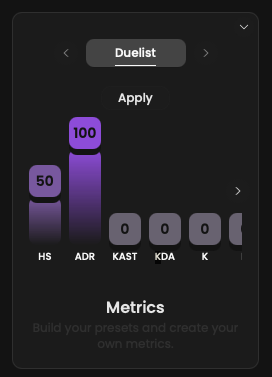

<Frame>
    
    
</Frame>

Our Metrics feature allows coaches to assign weights to statistics based on their personal preferences and the perceived
importance of those statistics for a specific role.
**For instance, you might believe that a duelist should prioritize ADR over HS.**

After aggregating all these weights, we calculate a score ranging **from 0 to 100**.

As you may understand, these scores are primarily focused on individual players, but they can also be used more broadly
to evaluate the performance of a team by calculating an average of its players.

## Steps

You can change weights at any time during your journey as the component is always displayed at the bottom left.

## Presets available

- `Global`
- `Duelist`
- `Sentinel`
- `Controller`
- `Initiator`
- `Custom`, please don't take into account this preset. It's not used for now.

## How roles are assigned

How we assign players roles is based solely on statistics.
If a player has played a significant amount of games with Jett, we will assign him the **Duelist** role.

Please note that a player can have up to 2 roles.
In this scenario, we will always use the primary role preset or **Global** depending on the page.

## What preset is used

Depending on the pages, we could use the **Global** or role preset.
Please refer to the documentation.
Whenever a Metrics score is displayed, we precise the preset in use.
