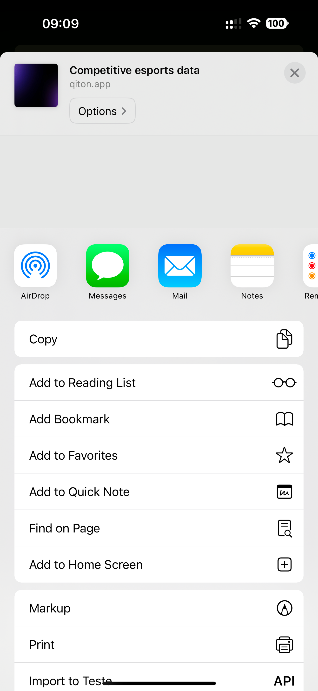

Qiton has been designed with accessibility in mind.
Since coaches and players are often on the move we provide a mobile application available on all platforms using PWA.
This way, you can access your precious data and statistics anytime, anywhere.

Here is how to set it up with iOS.

## Prerequisites

- An account

## Steps

Begin by retrieving your phone and opening [qiton.app](https://qiton.app).
Now tap on the share icon located at the bottom of the screen.

<Frame>
    
</Frame>

Then **Add to Home Screen** button.

<Frame>
    
</Frame>

Then **Add** button.

<Frame>
    
</Frame>

Qiton should be available on your home screen, and you can open it.
Log in, and you will now have access to your data.

<Frame>
    
</Frame>

_Please note that the steps described may slightly differ on other platforms like Android._
