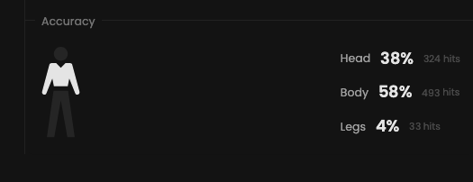

In Valorant like many other video games, aim is paramount and frequently determines your level.

## Prerequisites

- An active account ([learn more](/get-started/setup))
- You have to select a player beforehand ([learn more](/core/player/root))

## Target

This feature gives you the average number of head, body and leg shots.

<Frame>
    
    
</Frame>

## Filters

- `Dates`
- `Tournaments`
- `Scrims`
- `Officials`
- `Maps`

<Frame>
    
    
</Frame>