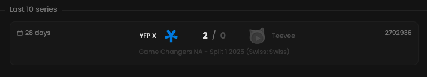

By selecting a specific player, you can view a list of the last 10 matches he played in.

## Prerequisites

- An active account ([learn more](/get-started/setup))
- You have to select a player beforehand ([learn more](/core/player/root))

## Steps

Navigate to the **History** tab.

## Preview

<Frame>
    
</Frame>
