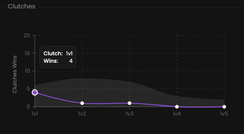

A clutch is when the last player alive wins the round, often when the odds of winning are lower.

## Prerequisites

- An active account ([learn more](/get-started/setup))
- You have to select a player beforehand ([learn more](/core/player/root))

## Steps

Navigate to the **Insights** tab.

## Preview

<Frame>
    
    
</Frame>

## Available statistics

- `Total wins & losses in 1v1 situations`
- `Total wins & losses in 1v2 situations`
- `Total wins & losses in 1v3 situations`
- `Total wins & losses in 1v4 situations`
- `Total wins & losses in 1v5 situations`

## Available filters

- `Dates`
- `Tournaments`
- `Scrims`
- `Officials`
- `Maps`

<Frame>
    
    
</Frame>
