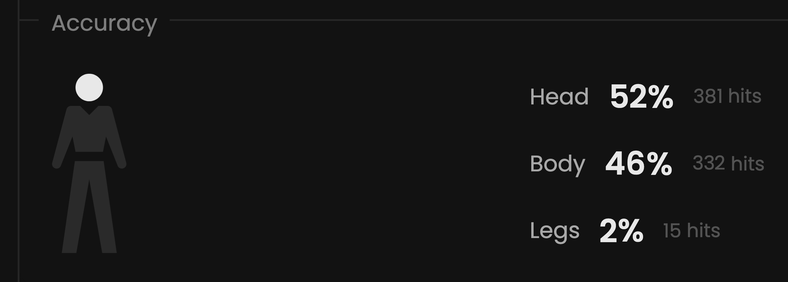

In Valorant like many other video games, aim is paramount and frequently determines your level.

## Prerequisites

- An active account ([learn more](/get-started/setup))
- You have to select a player beforehand ([learn more](/core/player/root))

## Steps

Navigate to the **Overview** tab.

## Preview

<Frame>
    
</Frame>

## Available statistics

- `Total & average hits in head`
- `Total & average hits in body`
- `Total & average hits in legs`

## Available filters

- `Dates`
- `Tournaments`
- `Scrims`
- `Officials`
- `Maps`

<Frame>
    
</Frame>

Modify the scope of the provided statistics based on the following situations.
- `Attack & defense`
- `Attack`
- `Defense`
