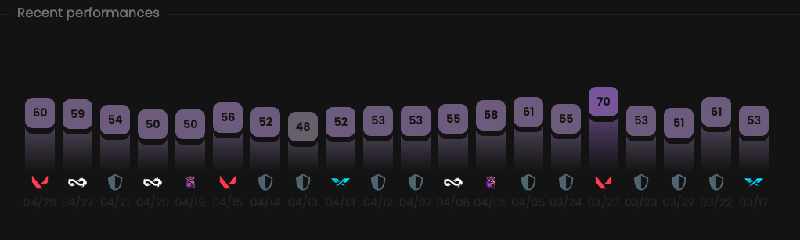

This chart empowers the Metrics feature by providing the latest scores for the selected player.
Each bar represents a single match.

## Prerequisites

- An active account ([learn more](/get-started/setup))
- You have to select a player beforehand ([learn more](/core/player/root))

## Steps

Navigate to the **Overview** tab.

## Preview

<Frame>
    
    
</Frame>

## Available statistics

- `Metrics per match`

Descriptions are available [here](/core/statistics-meaning).

## Available filters

- `Dates`
- `Tournaments`
- `Scrims`
- `Officials`
- `Maps`

<Frame>
    
    
</Frame>

## Metrics

Each Metrics score displayed on this page is calculated through the following steps.

1. For each sub-match linked to **the selected match**, we calculate a Metrics score by considering **the role’s
preset** and **the player’s statistics**.
2. We then calculate the final score by taking a **weighted average** of all these scores.

Learn more [here](/core/metrics).
