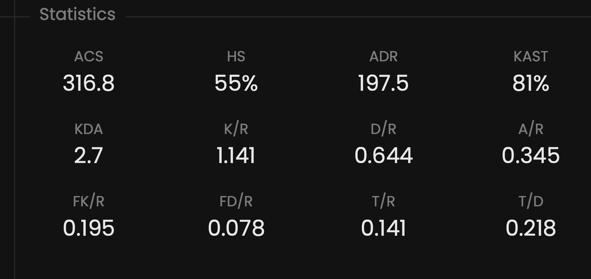

## Prerequisites

- An active account ([learn more](/get-started/setup))
- You have to select a player beforehand ([learn more](/core/player/root))

## Steps

Navigate to the **Overview** tab.

## Preview

<Frame>
    
    
</Frame>

## Available statistics

- `ACS`
- `HS`
- `ADR`
- `KAST`
- `KDA`
- `K/R`
- `D/R`
- `A/R`
- `FK/R`
- `FD/R`
- `T/R`
- `TD`

Descriptions are available [here](/core/statistics-meaning).

## Available filters

- `Dates`
- `Tournaments`
- `Scrims`
- `Officials`
- `Maps`

<Frame>
    
    
</Frame>
