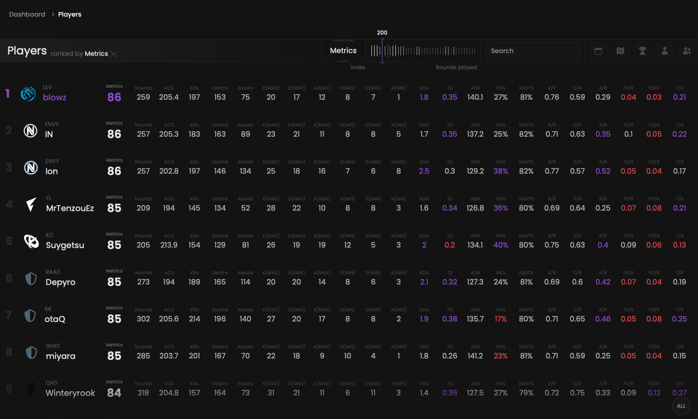

<Frame>
    <video
        autoPlay
        muted
        loop
        playsInline
        className="w-full aspect-video block dark:hidden"
        src="./images/root/presentation.mp4"
    ></video>
    <video
        autoPlay
        muted
        loop
        playsInline
        className="w-full aspect-video hidden dark:block"
        src="./images/root/presentation.mp4"
    ></video>
</Frame>

Rank and compare any player based on any available statistic.

## Prerequisites

- An active account ([learn more](/get-started/setup))

## Steps

Start by going to the players page at [qiton.app/players](https://qiton.app/players).
You will find all players detected by our system.

## Preview

<Frame>
    
    
</Frame>

## Available statistics

- `Metrics`
- `Rounds`
- `ACS`
- `Kills`
- `Deaths`
- `Assists`
- `K(MAX)`
- `D(MAX)`
- `A(MAX)`
- `K(MIN)`
- `D(MIN)`
- `A(MIN)`
- `KDA`
- `TD`
- `ADR`
- `HS`
- `KAST`
- `K/R`
- `D/R`
- `A/R`
- `FK/R`
- `FD/R`
- `T/R`

Descriptions are available [here](/core/statistics-meaning).

## Available filters

- `Index`
- `Minimum rounds`
- `Player's name`
- `Dates`
- `Maps`
- `Tournaments`
- `Agents`
- `Teams`

<Frame>
    
    
</Frame>

## Metrics preset

The preset **Global** is used on this page.
Learn more [here](/core/metrics).
