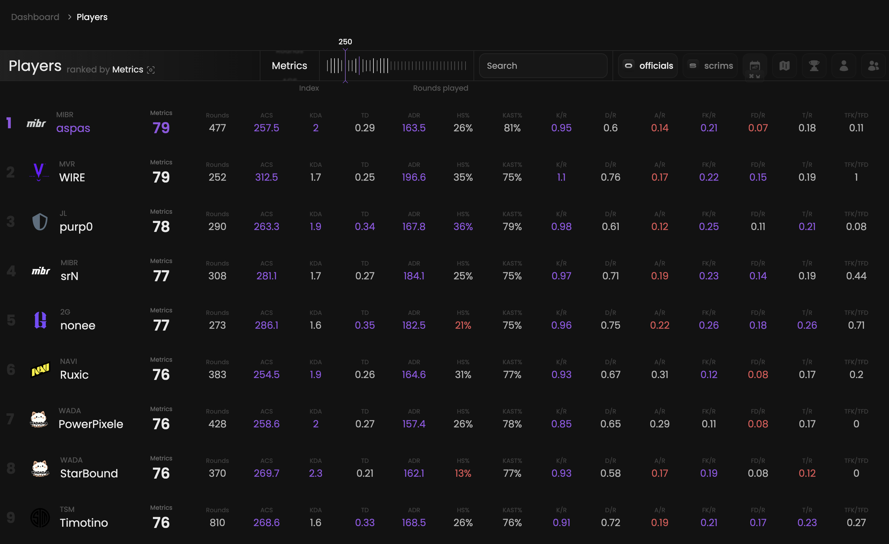

<Frame>
    <video
        autoPlay
        muted
        loop
        playsInline
        className="w-full aspect-video"
        src="./images/root/presentation.mp4"
    ></video>
</Frame>

Rank and compare any player based on any available statistic.

## Prerequisites

- An active account ([learn more](/get-started/setup))

## Steps

Start by going to the players page at [qiton.app/players](https://qiton.app/players).
You will find all players detected by our system.

## Preview

<Frame>
    
</Frame>

## Available statistics

- `Metrics`
- `Rounds`
- `ACS`
- `KDA`
- `TD`
- `ADR`
- `HS%`
- `KAST%`
- `K/R`
- `D/R`
- `A/R`
- `FK/R`
- `FD/R`
- `T/R`
- `TrueFKPerTrueFD`

Descriptions are available [here](/core/statistics-meaning).

## Available filters

- `Index`
- `Minimum rounds`
- `Player's name`
- `Officials`
- `Scrims`
- `Dates`
- `Maps`
- `Tournaments`
- `Agents`
- `Teams`

<Frame>
    
</Frame>

Modify the scope of the provided statistics based on the following situations.
- `Attack & defense`
- `Attack`
- `Defense`

## Metrics

Each Metrics score displayed on this page is calculated through the following steps.

1. We calculate a Metrics score by considering **the Global preset** and the average statistics of **the selected
player**.

Learn more [here](/core/metrics).
