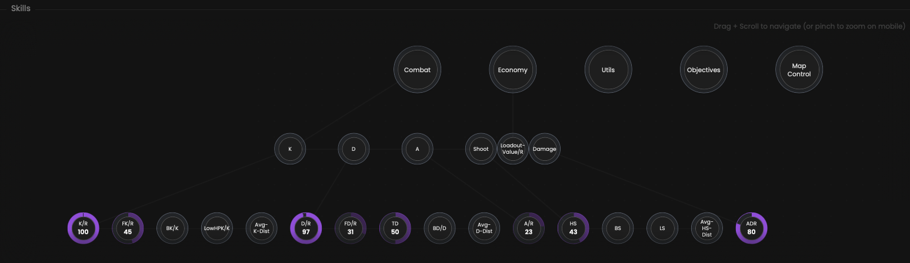

We gather all the available statistics about the selected player and make them available in a tree graph.

## Prerequisites

- An active account ([learn more](/get-started/setup))
- You have to select a player beforehand ([learn more](/core/player/root))

## Steps

Navigate to the **Skills** tab.

## Preview

<Frame>
    
</Frame>

## Available statistics

All data we have about the selected player will be displayed here.

Descriptions are available [here](/core/statistics-meaning).

## Available filters

- `Dates`
- `Tournaments`
- `Scrims`
- `Officials`
- `Maps`

<Frame>
    
</Frame>

Modify the scope of the provided statistics based on the following situations.
- `Attack & defense`
- `Attack`
- `Defense`
