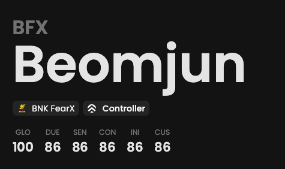

We provide access to the player summary, including his name, team and role.
Additionally, we compute several metrics scores for each role to analyze their impact.

## Prerequisites

- An active account ([learn more](/get-started/setup))
- You have to select a player beforehand ([learn more](/core/player/root))

## Preview

<Frame>
    
    
</Frame>

_Random values._

## Available statistics

- `Metrics with Global preset`
- `Metrics with Duelist preset`
- `Metrics with Sentinel preset`
- `Metrics with Controller preset`
- `Metrics with Initiator preset`

Descriptions are available [here](/core/statistics-meaning).
