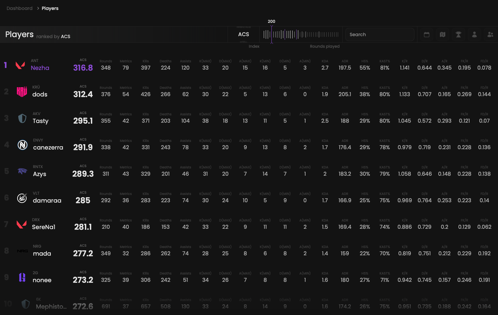

## Prerequisites

- An active account ([learn more](/get-started/setup))

## Steps

Start by going to the players page at [qiton.app/players](https://qiton.app/players).

You will find all players detected by our system below.
They are filtered alphabetically by default.

<Frame>
    
    
</Frame>

## Filters

Players are displayed in alphabetical order by default. You can use the team filter to view players from the selected team.
