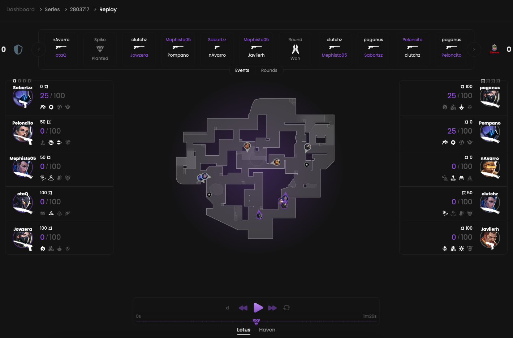

<Frame>
    <video
        autoPlay
        muted
        loop
        playsInline
        className="w-full aspect-video block dark:hidden"
        src="./images/replay/presentation.mp4"
    ></video>
    <video
        autoPlay
        muted
        loop
        playsInline
        className="w-full aspect-video hidden dark:block"
        src="./images/replay/presentation.mp4"
    ></video>
</Frame>

The replay feature enables you to revisit all players’ moves, kills and abilities during a round.
As a coach, this feature provides valuable insights into your players’ strengths and weaknesses.

## Prerequisites

- An active account ([learn more](/get-started/setup))
- You have to select a match beforehand ([learn more](/core/matches))

## Steps

Replay is available for all matches.
In the first place click on the “Replay” button, and you will be redirected.

<Frame>
    
    
</Frame>

## The player

Imagine our feature as a music player, allowing you to start, pause and speed up the timeline.

<Frame>
    
    
</Frame>
