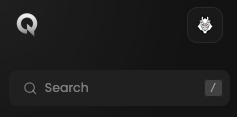
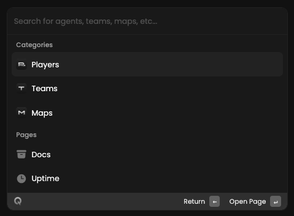

<Frame>
    <video
        autoPlay
        muted
        loop
        playsInline
        className="w-full aspect-video"
        src="./images/search-bar/presentation.mp4"
    ></video>
</Frame>

This search module is always available, like the Metrics one, during your journey.
Its purpose is to help you find a resource quickly.

## Prerequisites

- An active account ([learn more](/get-started/setup))

## Steps

<Frame>
    
</Frame>

To open the module, click on the search bar located in the top left corner of your screen.

## Preview

<Frame>
    
</Frame>

## Available filters

- `Player's name`
- `Team name`
- `Map name`
