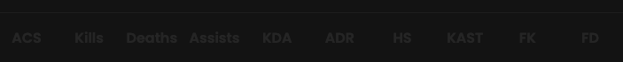

## Prerequisites

- An active account ([learn more](/get-started/setup))
- You have to select a match beforehand ([learn more](/core/matches))

## Scoreboard

<Frame>
    
    
</Frame>

Multiple scoreboards are available for each match:
- One globally (as you can see above)
- One per sub-match

## Details

<Frame>
    
    
</Frame>

### Basics

<Tabs>
    <Tab title="ACS">
        ACS stands for Average Combat Score. The ACS is calculated based on various factors, including kills, deaths,
        assists and the impact of abilities used during the game.
        **A higher value generally indicates better performance.**
    </Tab>
    <Tab title="Kills">
        Kills represents the number of opponents a player has eliminated.
        **A higher value generally indicates better performance.**
    </Tab>
    <Tab title="Deaths">
        Deaths refers to the number of times a player is eliminated during a match.
        **A lower value generally indicates better performance.**
    </Tab>
    <Tab title="Assists">
        Assists stands for assistance in a kill. An assist is recorded when a player contributes to the elimination of
        an opponent, usually by dealing damage or applying a debuff, but does not land the final blow.
        **A higher value generally indicates better performance.**
    </Tab>
    <Tab title="Trades">
        Trades occur when a teammate avenges a player's death by killing the opponent who eliminated them within 3
        seconds.
    </Tab>
</Tabs>

### Ratios

<Tabs>
    <Tab title="KDA">
        KDA stands for Kills Deaths Assists. The KDA ratio is calculated by adding kills and assists, then dividing by
        the number of deaths.
        **A higher value generally indicates better performance.**
    </Tab>
    <Tab title="ADR">
        ADR stands for Average Damage per Round. It represents the average amount of damage a player deals each round.
        **A higher value generally indicates better performance.**
    </Tab>
    <Tab title="HS">
        HS stands for Headshot Percentage. It indicates the percentage of kills made with headshots.
        Between 0 and 100. **A higher value generally indicates better accuracy.**
    </Tab>
    <Tab title="KAST">
        KAST stands for Kill Assist Survived Traded.
        The percentage of a player achieving at least one kill or one assist or one survival or one trade.
        Between 0 and 100. **A higher value generally indicates better performance.**
    </Tab>
    <Tab title="FK">
        FK stands for First Kill. This metric counts how often a player secures the first kill in a round.
        **A higher value generally indicates better performance.**
    </Tab>
    <Tab title="FD">
        FD stands for First Death. It tracks how often a player is the first to die in a round.
        **A lower value generally indicates better performance.**
    </Tab>
    <Tab title="TD">
        TD stands for Trade Death, a metric that measures the frequency of player trades within a round.
        **A higher value generally indicates better performance.**
    </Tab>
</Tabs>

### Per round

<Tabs>
    <Tab title="K/R">
        K/R stands for Kills per Round. This statistic measures the average number of kills a player gets each round.
        **A higher value generally indicates better performance.**
    </Tab>
    <Tab title="D/R">
        D/R stands for Deaths per Round. It tracks the average number of times a player dies per round.
        **A lower value generally indicates better performance.**
    </Tab>
    <Tab title="A/R">
        A/R stands for Assists per Round. This stat reflects the average number of assists a player provides each round.
        **A higher value generally indicates better performance.**
    </Tab>
    <Tab title="FK/R">
        FK/R stands for First Kills per Round. It measures how often a player secures the first kill in a round.
        Between 0 and 1. **A higher value generally indicates better performance.**
    </Tab>
    <Tab title="FD/R">
        FD/R stands for First Deaths per Round. This shows how often a player is the first to die in a round.
        Between 0 and 1. **A lower value generally indicates better performance.**
    </Tab>
    <Tab title="T/R">
        T/R stands for Trades per Round, indicating how frequently a player is traded.
    </Tab>
</Tabs>

## Metrics preset

Each player’s preset is determined by their role.
Learn more [here](/core/metrics).
