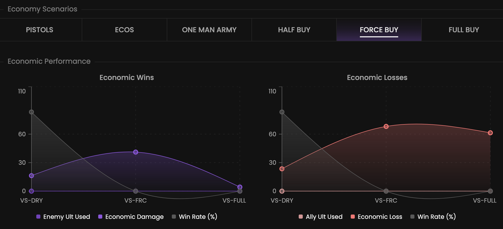

Let’s see which team manages its economy well and which doesn’t.

## Prerequisites

- An active account ([learn more](/get-started/setup))
- You have to select a team beforehand ([learn more](/core/team/root))

## Steps

Navigate to the **Economy** tab.

## Preview

<Frame>
    
</Frame>

## Available statistics

- `Winrate versus opponent scenarios resulting a positive economic strategy (compared to the selected scenario)`
- `Winrate versus opponent scenarios resulting a negative economic strategy  (compared to the selected scenario)`

## Available filters

- `Dates`
- `Tournaments`
- `Scrims`
- `Officials`
- `Maps`

<Frame>
    
</Frame>

Modify the scope of the provided statistics based on the following situations.
- `Attack & defense`
- `Attack`
- `Defense`
