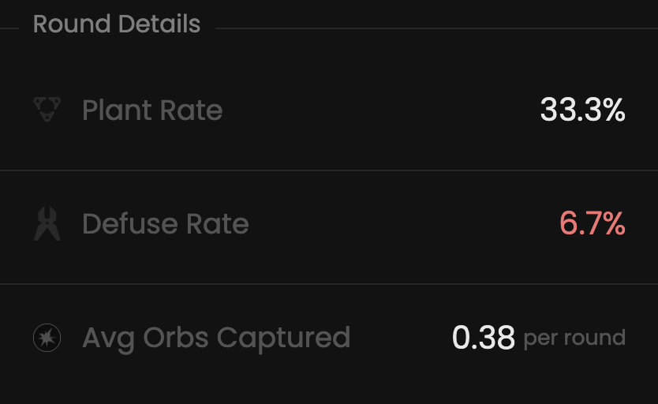

Access to round data filtered by the team and the economic situation.

## Prerequisites

- An active account ([learn more](/get-started/setup))
- You have to select a team beforehand ([learn more](/core/team/root))

## Steps

Navigate to the **Economy** tab.

## Preview

<Frame>
    
</Frame>

## Available statistics

- `Plant rate`
- `Defuse rate`
- `Average ORBs captured`

## Available filters

- `Scenarios` (pistols, ecos, one man army, half buy, force buy or full buy)
- `Dates`
- `Tournaments`
- `Scrims`
- `Officials`
- `Maps`

<Frame>
    
</Frame>

Modify the scope of the provided statistics based on the following situations.
- `Attack & defense`
- `Attack`
- `Defense`
