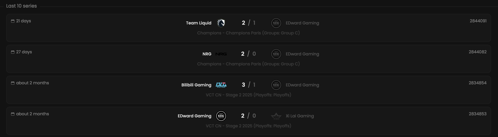

By selecting a specific team, you can view a list of its last 10 matches.

## Prerequisites

- An active account ([learn more](/get-started/setup))
- You have to select a team beforehand ([learn more](/core/team/root))

## Steps

Navigate to the **History** tab.

## Preview

<Frame>
    
</Frame>
