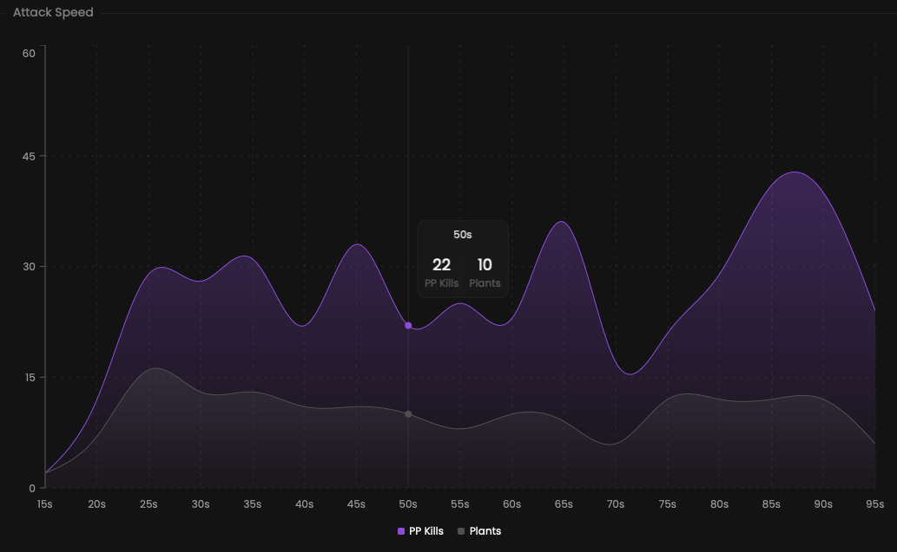

Our attack speed chart allows you to analyze how and when team members plant the bomb during a round.

## Prerequisites

- An active account ([learn more](/get-started/setup))
- You have to select a team beforehand ([learn more](/core/team/root))

## Steps

Navigate to the **Insights** tab.

## Preview

<Frame>
    
    
</Frame>

## Available statistics

- `Total pre-plant kills each 5 seconds`
- `Total plants each 5 seconds`
