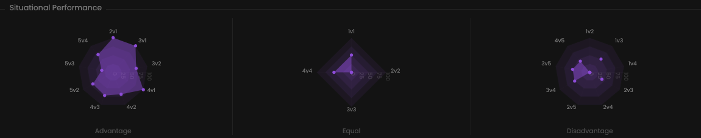

These charts illustrate your winrates in various scenarios.

## Prerequisites

- An active account ([learn more](/get-started/setup))
- You have to select a team beforehand ([learn more](/core/team/root))

## Steps

Navigate to the **Insights** tab.

## Preview

<Frame>
    
</Frame>

## Available statistics

- `Total wins & losses in advantageous situations`
- `Total wins & losses in disadvantageous situations`
- `Total wins & losses in equal situations`

## Available filters

- `Dates`
- `Tournaments`
- `Scrims`
- `Officials`
- `Maps`

<Frame>
    
</Frame>

Modify the scope of the provided statistics based on the following situations.
- `Attack & defense`
- `Attack`
- `Defense`
