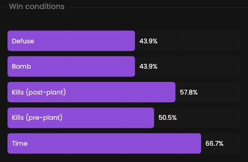

Identify the factors that determine your success or failure.

## Prerequisites

- An active account ([learn more](/get-started/setup))
- You have to select a team beforehand ([learn more](/core/team/root))

## Steps

Navigate to the **Insights** tab.

## Preview

<Frame>
    
</Frame>

## Available statistics

First chart:
- `Total attack losses: Defuse`
- `Total attack wins: Bomb`
- `Total attack wins: Kills (post-plant)`
- `Total attack wins & losses: Kills (pre-plant)`
- `Total attack losses: Time`

Second chart:
- `Total defense wins: Defuse`
- `Total defense losses: Bomb`
- `Total defense losses: Kills (post-plant)`
- `Total defense wins & losses: Kills (pre-plant)`
- `Total defense wins: Time`

## Available filters

- `Dates`
- `Tournaments`
- `Scrims`
- `Officials`
- `Maps`

<Frame>
    
</Frame>
