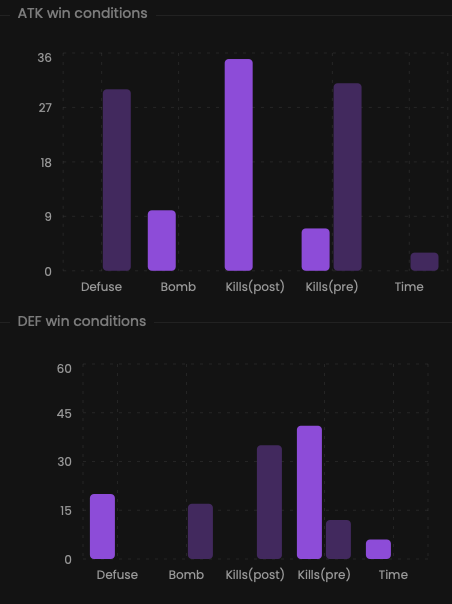

Identify the factors that determine your success or failure.

## Prerequisites

- An active account ([learn more](/get-started/setup))
- You have to select a team beforehand ([learn more](/core/team/root))

## Steps

Navigate to the **Insights** tab.

## Preview

<Frame>
    
    
</Frame>

## Available statistics

- `Wins percentage: Defuse`
- `Wins percentage: Bomb`
- `Wins percentage: Kills (post-plant)`
- `Wins percentage: Kills (pre-plant)`
- `Wins percentage: Time`

## Available filters

Modify the scope of the provided statistics based on the following situations.
- `Attack & defense`
- `Attack`
- `Defense`
