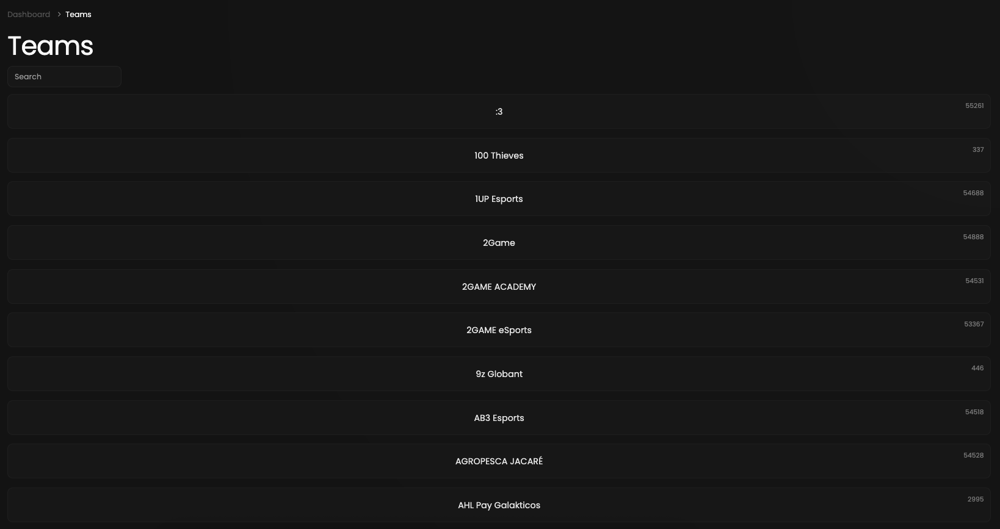
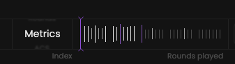

This comprehensive list presents crucial statistics about all teams, making it easy to compare them with our filters.

## Prerequisites

- An active account ([learn more](/get-started/setup))

## Steps

Start by going to the teams page at [qiton.app/teams](https://qiton.app/teams).
You will find all teams detected by our system.

## Preview

<Frame>
    
</Frame>

## Available statistics

- `Metrics`
- `Rounds`
- `ACS`
- `KDA`
- `TD`
- `ADR`
- `HS`
- `KAST`
- `K/R`
- `D/R`
- `A/R`
- `FK/R`
- `FD/R`
- `T/R`
- `Kills`
- `Deaths`
- `Assists`
- `K(MAX)`
- `D(MAX)`
- `A(MAX)`
- `K(MIN)`
- `D(MIN)`
- `A(MIN)`

Descriptions are available [here](/core/statistics-meaning).

## Available filters

- `Index`
- `Minimum rounds`
- `Team name`
- `Dates`
- `Maps`
- `Tournaments`

<Frame>
    
</Frame>

Modify the scope of the provided statistics based on the following situations.
- `Attack & defense`
- `Attack`
- `Defense`

## Metrics

Each Metrics score displayed on this page is calculated through the following steps.

1. We calculate a Metrics score by considering **the Global preset** and the average players' statistics composing
**the selected team**.

Learn more [here](/core/metrics).
